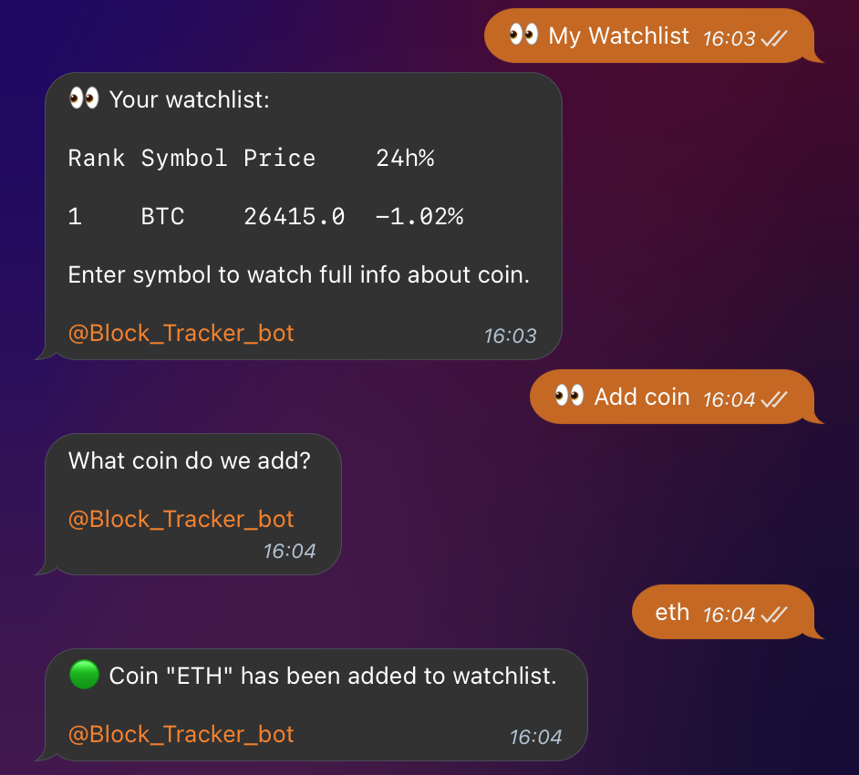

# BlockTracker
This is a bot for tracking cryptocurrencies prices and portfolios.
Here I use free CoinGecko API, so information is only available for top 250 cryptocurrencies.
## For developer
### In order to launch this project you need to:
- Refer to dao classes to create database.
- Go to `src/main/java/org/vitaliistf/AppConfiguration.java`
and fill static fields with your database connection information, bot username and token.
- Start the application.
### Project description:
- There are classes that represent cache and CoinGecko API connector in `coingecko` package.
- There is `AppConfiguration` class. It represents configuration for application.
- All the communications of a bot work through classes in `controllers` package.
Each class work mostly with one model and designed for processing user requests, 
sending messages and saving data in database.
- `dao` package classes represent data access objects for each model.
_Note that there is no `watchlist` model, but there is `WatchlistDao` class, 
designed to save watchlist information for users._ 
- There is `Menu` class in `menu` package. It represents menu layout.
- `models` package is designed for all the models that are used.
- `sessions` package contains classes to save user sessions for polling.
- `BlockTracker` class represents bot itself.
- There is `PrintFormatter` class in `util` package, it is designed to format 
data before sending it to user.
## For user
Note that there is keyboard menu designed for this bot. All the commands are used through this menu.
### What this bot does?
- You can get price for any cryptocurrency by clicking `📈 Price` button. Then you input _(case-insensitive)_ symbol 
of the coin, and receive the price. _The price may be put out in scientific notation for compactness._

- You can get your watchlist (`👀 My Watchlist`) and add/remove coins to it.

- To get detailed info about coin from your watchlist, type the symbol.

- You can add portfolio for your account. (`💼 Show portfolios` / `💼 New portfolio`)

- In order to add coin to your portfolio, input `📃 New transaction` and follow instructions.

- Then your portfolio will look like this.

- You can watch your transactions. (`📃 Show transactions`)

- Actually, there are much more actions that you can do here. 
Explore yourself: https://t.me/Block_Tracker_bot
